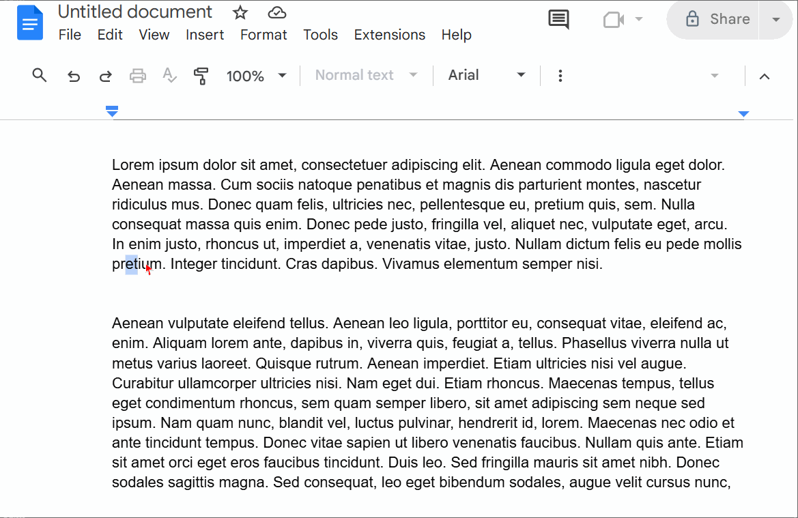
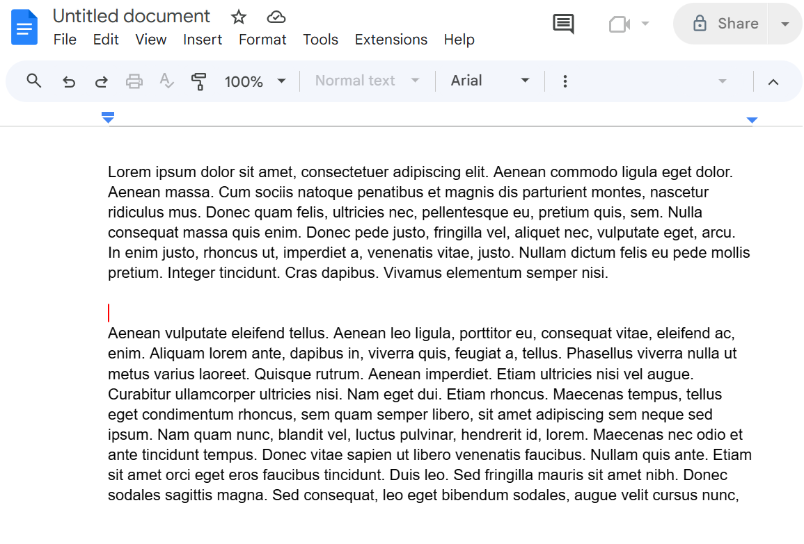
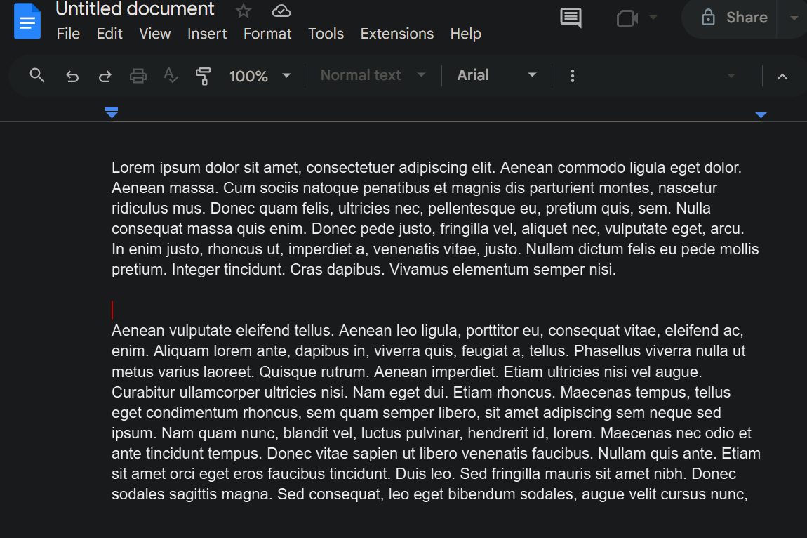

# TamperMonkey-Red-Cursor-Google-Docs

A lightweight TamperMonkey userscript that makes the text caret (blinking cursor) bright red in Google Docs for improved visibility.  
Optionally, it can also replace the mouse pointer with a red arrow for better contrast.  
Now includes a built-in control panel to customize caret color, pointer color, and pointer size, with settings saved automatically.

---

### Animated Demo

---

## Install Methods

There are two ways to install this script. Most users should use **Option 1 (Recommended)**.  
Option 2 is provided only for reference and is not maintained.

### Option 1: Recommended – Launcher Stub
This method uses a tiny stub file (`docs-caret-vis-control.user.js`) that automatically pulls in the full implementation and keeps it updated.

1. Install [TamperMonkey](https://www.tampermonkey.net/).
2. Open the **Raw** link to [`TamperMonkey-Installer-docs-caret-vis-control.user.js`](https://raw.githubusercontent.com/IanWardell/TamperMonkey-Red-Cursor-Google-Docs/main/TamperMonkey-Installer-docs-caret-vis-control.user.js).  
   TamperMonkey will prompt to install or update automatically.
3. Reload any open Google Docs tabs.

### Option 2: Manual – Legacy Script (Not Updated)
This is an older standalone script. It works, but it is **not actively updated**. Use only if you specifically want a single self-contained script without relying on the stub.

1. Install TamperMonkey
2. Open the **Raw** link to [`tampermonkey-cursor-control.js`](https://github.com/IanWardell/TamperMonkey-Red-Cursor-Google-Docs/blob/main/tampermonkey-cursor-control.js).
3. Copy/paste the contents into a new TamperMonkey script or confirm the installation prompt.
4. Reload any open Google Docs tabs.

---

### Static Screenshots
| Light Mode | Dark Mode |
|------------|-----------|
|  |  |

---

## Features
- High-contrast red caret overlay in Google Docs
- Optional red mouse pointer (with adjustable size)
- Works inside Docs iframes
- Full debug logging (toggleable)
- Hotkeys (fully disableable with one switch)
- Interactive control panel:
  - Change caret color
  - Change pointer color
  - Adjust pointer size with a slider
  - Save settings (persist across reloads)
  - Exit the panel with a button or Escape key
- Configurable via script variables:
  - `CARET_COLOR` – caret color (default: `#ff0000`)
  - `POINTER_COLOR` – pointer arrow color (default: `#ff0000`)
  - `CARET_WIDTH` – caret width in pixels
  - `CARET_BLINKMS` – blink speed
  - `HOLD_LAST_MS` – keep caret visible briefly on selection flicker
  - `RED_POINTER_ENABLED` – toggle red pointer on/off
  - `RED_POINTER_FORCE_EVERYWHERE` – override I-beam everywhere (or keep I-beam in text fields)
  - `RED_POINTER_PIXEL_SIZE` – pointer nominal size (in pixels)
  - `HOTKEYS` – enable/disable hotkeys entirely
  - `DEBUG` – enable/disable debug logs

## Hotkeys (when `HOTKEYS = true`)
Use `Ctrl+Alt+` + key combinations:
- `C` – toggle caret overlay
- `D` – toggle debug logging
- `P` – toggle red pointer
- `- / +` – decrease / increase pointer size
- `9` – reset all colors and pointer size to a defaults preset
- `O` – open/close the control panel (caret color, pointer color, pointer size)
- `S` – save options panel settings without closing the panel
- `Esc` – Escape/Close options panel
---

## Files
- `docs-caret-vis-control.user.js` — minimal userscript stub with metadata and `@require` to load the implementation (**actively maintained**)
- `pointer-caret-color-vis-control.js` — modular userscript implementation (used by the stub, actively maintained)
- `tampermonkey-cursor-control.js` — legacy standalone script (**not updated long term**)
- `README.md`, `LICENSE`

## License
This project is licensed under the MIT License – see [LICENSE](./LICENSE).
